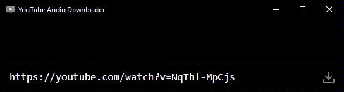

## Description

`ytad` (YouTube Audio Downloader) is a Windows app for converting YouTube videos to MP3 files. Built with the `Electron` framework, it uses the `ytdl-core` library to fetch video data and `ffmpeg` to convert the output into MP3 format.



## Usage

- Visit the [releases](https://github.com/PD-22/ytad/releases) page and download the latest `setup.exe` file.
- Open the app and click on the input field at the bottom if it's not already active
- Paste a YouTube video link `https://youtube.com/watch?v=...`
- Press Enter or click the download button if the download doesn't start automatically
- Wait for the loading indicator at the top to finish
- To open the downloaded file, click the button next to the video title
- To choose a different download location, use the folder button next to the download button
- To stop a download, use the cancel button on the loading spinner
- Retry or remove failed downloads using the buttons next to the stopped video titles
- The app supports pasting multiple space-separated links to download them one by one

Shortcut | Description
-|-
<kbd>F11</kbd> | Fullscreen
<kbd>F5</kbd> or <kbd>Ctrl+R</kbd> | Reload
<kbd>Ctrl+F</kbd> | Choose download location
<kbd>Escape</kbd> | Focus on link input
<kbd>Ctrl+Enter</kbd> | Submit link for download

## Development

```bash
# Clone the repository into the current directory
git clone https://github.com/PD-22/ytad.git

# Navigate to the repository directory
cd ytad

# Check if Node.js is installed
node --version

# Install the necessary packages
npm install

# Start the app in development mode
npm run dev

# Optionally, use nodemon for automatic restarts during development
npm install -g nodemon
nodemon --exec electron .

# Build the app and generate distributables
npm run make
```
